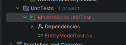
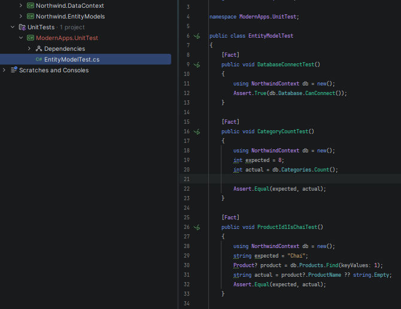
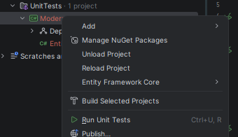
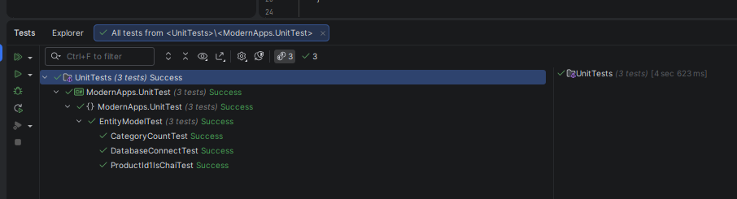
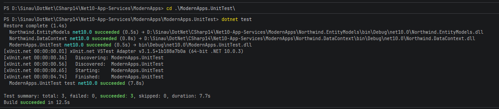
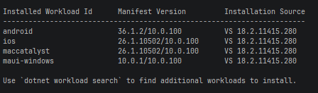

# Net10-App-Services

## Setup

```bash
dotnet new sln --name Net10-App-Services
dotnet new console --name Net10-App-Services.Console --output src/Net10-App-Services.Console --no-gitignore
dotnet sln add src/Net10-App-Services.Console
```

```bash
Setup Directory.Packages.props
Setup nuget.config
Add sql-scripts folder
```

## Pulling the SQL Server Database 2025

Because SQL Server image run at 64bit, you can use Azure SQL Edge, but the Azure SQL Edge does not supported by Microsoft, but you still can use it.

```bash
docker pull mcr.microsoft.com/mssql/server:2025-latest
```

## Running the SQL Server Database 2025

```bash
docker run -e "ACCEPT_EULA=Y" -e "MSSQL_SA_PASSWORD=YourStrongPassword123!" -p 1433:1433 --name sqlserver2025 -d mcr.microsoft.com/mssql/server:2025-latest
```

```bash
docker pull mcr.microsoft.com/azure-sql-edge:latest
```

```bash
docker run -e "ACCEPT_EULA=Y" -e "MSSQL_SA_PASSWORD=YourStrongPassword123!" -p 1433:1433 --name sqlserver2025 -d mcr.microsoft.com/azure-sql-edge:latest
```

## Create Northwind Entity Models

Create ModernApps solutions and add Northwind.EntityModels

Steps to do:

1. Build the project
   
   ```bash
   dotnet build
   ```

2. Do Database Scaffold to generate Entity Class from table(s)
   
   ```bash
   dotnet ef dbcontext scaffold "Data Source=[Database Server];Initial Catalog=Northwind;User Id=[secret_user];Password=[secret_password];TrustServerCertificate=true;" Microsoft.EntityFrameworkCore.SqlServer --namespace Northwind.EntityModels --data-annotations
   ```
   
    The command to perform: `dotnet ef dbcontext scaffold`
    The connection string: "Data Source=tcp:127.0.0.1,1433;Initial Catalog=Northwind;User Id=sa;Password= s3cret-Ninja;TrustServerCertificate=true;"
    The database provider: `Microsoft.EntityFrameworkCore.SqlServer`
    The namespace: `--namespace Northwind.EntityModels`
    To use data annotations as well as the Fluent API: `--data-annotations`

3. Add Northwind.DataContext

4. Add Northwind.DataContext.Extensions

5. Setting user and password for SQL Server (using environtment variables)
   On windows using:
   
   ```bash
   setx MY_SQL_USR "sa"
   setx MY_SQL_PWD "s3cret-Ninja"
   ```
   
   On Linux using:
   
   ```bash
   export MY_SQL_USR="sa"
   export MY_SQL_PWD="s3cret-Ninja"
   ```

6. Modify some class and add some validation
   Customer Class
   
   ```csharp
   [Key]
   [StringLength(5)]
   [RegularExpression("[A-Z]{5}")]
   public string CustomerId { get; set; } = null!;
   ```
   
   Order Class
   
   ```csharp
   [Key]
   [StringLength(5)]
   [RegularExpression("[A-Z]{5}")]
   public string CustomerId { get; set; } = null!;
   ```

7. Add Unit Test
   
   Create unit test project inside ModernApps solution
   
   
   
   
   
   Run Unit Test
   
   
   
   
   
   Using Terminal 
   
   ```bash
   dotnet test
   ```
   
   

# Introduction To .Net MAUI

Cek .Net MAUI installed or not

```bash
dotnet workload list
```



If does not exists then install using this command:

```bash
dotnet workload install maui
```

To update all existing workload installations:

```bash
dotnet workload update
```

If something missing, use this command to

```bash
dotnet workload restore <projectname>
```

remove unneeded workload you can used this command:

```bash
dotnet workload clean
```

To build an application using .Net Maui, component categorized into:

- Pages --> represent application screens, `Shell`, `ContentPage`, `NavigationPane`, `FlyoutPage`, `TabbedPane`

- Layouts --> structure of a combination, `Grid`, `StackLayout`, `FlexLayout`

- Views --> represent a single UI component, `CarouselView`, `CollectionView`, 
  `Label`, `Entry`, `Editor`, and `Button`

- Cells --> represent a single item in a list or table view, `TextCell`, `ImageCell`, 
  `SwitchCell`, and `EntryCell`

Writing platform specific code

```csharp
#if __ANDROID__
  Handlers.EntryHandler.EntryMapper[nameof(IEntry.BackgroundColor)] = (h, v) =>
  {
    (h.NativeView as global::Android.Views.Entry).UnderlineVisible = false;
  };
#endif
```

Predefine compiler constant

• __ANDROID__
• __IOS__
• WINDOWS

Compiler #if in .Net MAUI is different in #if in C#

```csharp
#if __IOS__
  // iOS-specific statements
#elif __ANDROID__
  // Android-specific statements
#elif WINDOWS
  // Windows-specific statements
#endif
```

s
